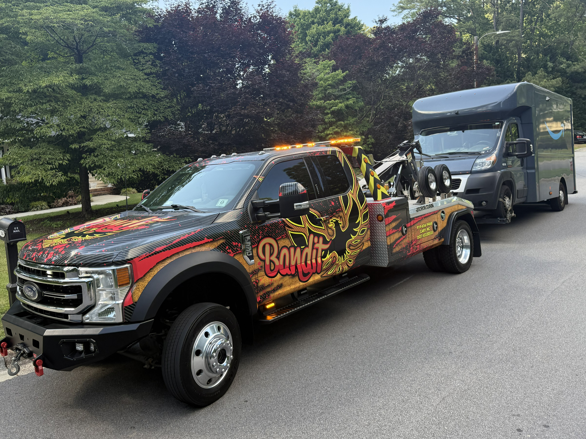

# How to Swap Service Card Photos

Each service card on the homepage has its own photo. Here's how to change them in 3 steps:

## Step 1 — Add your photo to the images folder
Copy your photo into the `/images/` folder inside the website.
- Use JPG or PNG format
- Recommended size: at least **800×500px** (landscape/horizontal)
- You can name it anything (e.g. `my-tow-truck.jpg`)

## Step 2 — Find the right card in index.html
Open `index.html` and look for the comment above each card:

```html
<!-- CARD 1 — swap src to your own photo of a tow truck on the road -->
<a href="#pricing" class="svc-card">
  <div class="svc-thumb">
    

<img src="images/my-flatbed-truck.jpg" alt="On-Road Towing" class="svc-img" ...
```

## Notes
- If a photo is missing or fails to load, a styled dark Bandit-themed placeholder shows automatically
- The gold overlay, diagonal stripe texture, and hover effects all apply on top of your photo automatically
- Photos display at 200px tall and fill the full card width — horizontal/landscape photos look best
